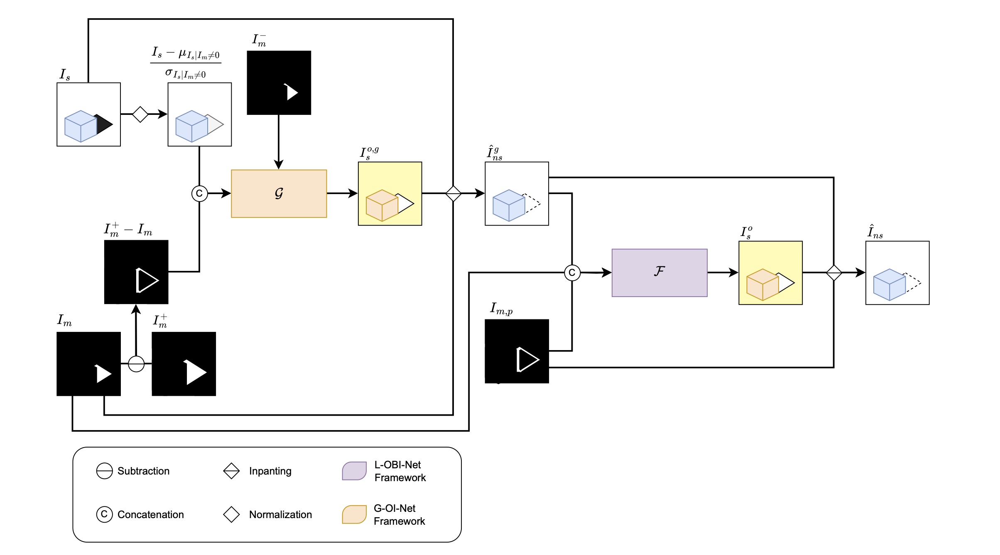

# Global and Local Re-Illumination Methods for Efficient Single Image Shadow Removal
This is the official implementation of the thesis [Global and Local Re-Illumination Methods for Efficient Single Image Shadow Removal](-).

## Introduction
To tackle image shadow removal problem, we propose three novel re-illumination-based methods for single-image shadow removal: G-OI-Net, L-OBI-Net, and G4L-OBI-Net. Being re-illumination-based these methods focus on re-illumination parameter estimation rather than generating entirely new pixel values, which simplifies the overall system and reduces the risk of introducing artifacts. These convolutional neural network frameworks generate overexposed images to effectively address shadowed regions, leveraging the shadow boundary region (penumbra) as a key focus area due to its complexity. The proposed methods restore shadowed areas by inpainting overex-posed regions with the original shadowed image, ensuring the preservation of non-shadowed areas. 

The models operate at different levels:

- **G-OI-Net** is a fast and efficient shadow removal solution. This method is designed to extract three global re-illumination parameters, one for each RGB channel, optimized to achieve the best overexposure effect. The overexposed image, combined with an inpainting process in the shadow-affected areas, yields the final shadow-free result. Furthermore, G-OI-Net introduced a pre-overexposure stage, where the input shadow region
is normalized and re-illuminated using parameters derived from the shadow contour region.

<p align=center></p>

- **L-OBI-Net**, is a more complex U-Net-based solution aimed at achieving optimal shadow removal while maintaining efficiency. This method integrates boundary awareness, which significantly improves shadow removal results and reduces ghosting effects. In addition to the shadow-affected image and corresponding shadow mask, the model also requires a penumbra region mask as input, enabling a focus on this critical transition area. This focus is further reinforced in the loss function. The network predicts pixel-wise re-illumination kernels, applied to the shadow image to generate the overexposed image. The final shadow-free image is obtained by merging the original non-shadow regions with the over-
exposed shadow regions through an inpainting process. This ensures smooth transitions in the penumbra region, achieving effective shadow removal.

<p align=center></p>

- **G4L-OBI-Net**, was conceptualized to implement a global step as a preliminary stage for local refinement. However, this solution did not achieve the desired results. In this method, the input shadow image undergoes a global overexposure step as an initial approximation of shadow removal, brightening the shadowed areas uniformly. This is followed by a pixel-wise local refinement stage, where each pixel in the shadow region is adjusted using locally derived parameters.

<p align=center></p>

Additionally, we identified and critiqued a common issue in evaluating shadow removal performance across different regions of an image (shadow region, non-shadow region, and entire image). We highlighted how the conventional application of shadow masks distorts results, making it impossible to compare performance across different areas of the same image or dataset. We proposed a solution that evaluates only the relevant pixels or areas, yielding meaningful numerical results that enable a fair comparison of how shadow removal methods perform in shadow and non-shadow regions.

For more details, please refer to our [original work](-)

## Requirement
* Python 3.9
* Pytorch 2.4
* CUDA 12.4
```bash
pip install -r requirements.txt
```

## Datasets
* ISTD [[Training/Testing]](https://github.com/DeepInsight-PCALab/ST-CGAN)  
* ISTD+ [[Training/Testing]](https://github.com/cvlab-stonybrook/SID)
* SRD [[Training]](https://drive.google.com/file/d/1W8vBRJYDG9imMgr9I2XaA13tlFIEHOjS/view)[[Testing]](https://drive.google.com/file/d/1GTi4BmQ0SJ7diDMmf-b7x2VismmXtfTo/view)

## Pretrained models
* G-OI-Net: [ISTD](https://drive.google.com/drive/folders/1DznywJKvvpaTMRIMHwx1fTc_BMHAW81G?usp=share_link) | [ISTD+](https://drive.google.com/drive/folders/1pmrcCQI_0Y5fZd2XGZx67PNokDXr1wWw?usp=share_link) | [SRD](https://drive.google.com/drive/folders/1TfDOax2sP0SW3k4SpbNggSlLLDGC3df1?usp=share_link)
* L-OBI-Net: [ISTD](https://drive.google.com/drive/folders/1ynFZPF7IpczbNlCFqGe9e_hrnz8o5_eW?usp=share_link) | [ISTD+](https://drive.google.com/drive/folders/1rieRLry1p2c2KsMvErd6DnVSghxTyRdx?usp=share_link) | [SRD](https://drive.google.com/drive/folders/1w9fR-yj0eBVqh6fzjLiZpm-DulreTb-V?usp=share_link)
* G4L-OBI-Net: [ISTD](https://drive.google.com/drive/folders/1ogxrbmhJ1RS2R3LuPFBCOzBd--rHdZYY?usp=share_link) | [ISTD+](https://drive.google.com/drive/folders/13v6OVOGmNnWUKBCz3gqUQpFUmwG09nQ0?usp=share_link) | [SRD](https://drive.google.com/drive/folders/1F9-MUW1Nn0EYQL_JthIQ4h-_H6o6py3D?usp=share_link)

Please download the corresponding pretrained model and modify:
- `model_path` option in `GOINet_test.py`.
- `model_path` option in `LOBINet_test.py`.
- `global_model_patht` and `local_model_path` options in `G4LOBINet_test.py`.
  
## Test
You can directly test the performance of the pre-trained models as follows
1. Modify the paths to dataset and pre-trained model. You need to modify the following path:
  - For `GOINet_test.py` and `LOBINet_test.py`:
      ```python
      dataset_path
      model_path
      ```
  - For `G4LOBINet_test.py`:
      ```python
      global_model_patht
      local_model_path
      model_path
      ```
2. Test the models
```python
python GOINet_test.py --save_images True
```
```python
python LOBINet_test.py --save_images True
```
```python
python G4LOBINet_test.py --save_images True
```
You can check the output in `./output`.

## Train
1. Download datasets and set the following structure
```
|-- ISTD_Dataset
    |-- train
        |-- train_A # shadow image
        |-- train_B # shadow mask
        |-- train_C # shadow-free GT
    |-- test
        |-- test_A # shadow image
        |-- test_B # shadow mask
        |-- test_C # shadow-free GT
```
2. You need to modify the following terms in `GOINet.py`, `LOBINet.py` and `G4LOBINet.py` based on wich model you want to train.
```python
dataset_path # path to the dataset root
gpu: 0 # GPU id to use for training, -1 for CPU
```
3. Train the network
If you want to train the network on 256X256 images:
```python
python GOINet.py --dataset_path /path/to/dataset --img_height 256 --img_width 256
```
```python
python LOBINet.py --dataset_path /path/to/dataset --img_height 256 --img_width 256
```
```python
python G4LOBINet.py --dataset_path /path/to/dataset --img_height 256 --img_width 256
```
or you want to train on original resolution, e.g., 480X640:
```python
python GOINet.py --dataset_path /path/to/dataset --img_height 640 --img_width 480
```
```python
python LOBINet.py --dataset_path /path/to/dataset --img_height 640 --img_width 480
```
```python
python G4LOBINet.py --dataset_path /path/to/dataset --img_height 640 --img_width 480
```

## Evaluation
The results reported in the paper are calculated by the `matlab` script. Details refer to:
- `eval/measure_shadow.m`: images are resized 256x256 and the standard way of evaluating is used
- `eval/measure_shadow_orig.m`: images are not resized and the standard way of evaluating is used
- `eval/measure_shadow_true.m`: images are resized 256x256 and the proposed new way of evaluating is used
- `eval/measure_shadow_true_orig.m`: images are not resized and the proposed new way of evaluating is used

## Results
#### Quantitative comparison with state-of-the-art methods on ISTD+, using the standard way of calculating the evaluation metrics.
The evaluation results are as follows

| **Method**                 | **PSNR (S) ↑** | **SSIM (S) ↑** | **MAE (S) ↓** | **PSNR (NS) ↑** | **SSIM (NS) ↑** | **MAE (NS) ↓** | **PSNR (ALL) ↑** | **SSIM (ALL) ↑** | **MAE (ALL) ↓** |
|----------------------------|----------------|----------------|---------------|-----------------|-----------------|----------------|------------------|------------------|-----------------|
| Input Image            | 20.81          | 0.9266         | 38.53         | 33.88           | 0.9553          | 3.33           | 20.22            | 0.8748           | 3.05            |
| DHAN                  | 32.45          | 0.9834         | 10.17         | 26.21           | 0.9433          | 7.90           | 24.86            | 0.9244           | 2.75            |
| SG-ShadowNet           | 35.96          | 0.9845         | 7.27          | 32.76           | 0.9503          | 3.79           | 30.50            | 0.9305           | 1.43            |
| BMNet                | 36.81          | 0.9865         | 6.58          | 34.47           | 0.9577          | 3.24           | 31.85            | 0.9411           | 1.24            |
| ShadowFormer           | 38.07          | 0.9864         | 6.16          | 35.15           | 0.9550          | 3.15           | 32.78            | 0.9388           | 1.20            |
| LFG-Diffusion         | 37.74          | 0.9865         | 6.07          | 34.30           | 0.9515          | 3.51           | 32.11            | 0.9357           | 1.30            |
| **G-OI-Net**               | 33.76          | 0.9747         | 11.13         | 33.81           | 0.9552          | 3.34           | 30.23            | 0.9199           | 1.46            |
| **L-OBI-Net**              | 36.48          | 0.9854         | 6.90          | 34.42           | 0.9557          | 3.30           | 31.69            | 0.9380           | 1.28            |
| **G4L-OBI-Net**            | 35.60          | 0.9817         | 7.84          | 34.35           | 0.9558          | 3.30           | 31.29            | 0.9335           | 1.32            |  


#### Quantitative comparison with state-of-the-art methods on ISTD, ISTD+ and SRD datasets, using the proposed way of calculating the evaluation metrics.
The evaluation results are as follows

|**Dataset** | **Method**                 | **PSNR (S) ↑** | **SSIM (S) ↑** | **MAE (S) ↓** | **PSNR (NS) ↑** | **SSIM (NS) ↑** | **MAE (NS) ↓** | **PSNR (ALL) ↑** | **SSIM (ALL) ↑** | **MAE (ALL) ↓** |
|------------|---------------------------------|--------|----------|---------|--------|----------|---------|--------|----------|---------|
| **ISTD**   | Input Image                    | 13.35  | 0.6832   | 33.60   | 25.67  | 0.9230   | 7.59    | 20.33  | 0.8742   | 3.78    |
|            | DHAN                           | 25.79  | 0.8695   | 8.43    | 28.76  | 0.9215   | 5.92    | 27.88  | 0.9215   | 2.10    |
|            | BMNet                          | 25.84  | 0.8689   | 8.31    | 30.36  | 0.9300   | 5.16    | 29.02  | 0.9287   | 1.86    |
|            | ShadowFormer                   | 28.03  | 0.8857   | 6.91    | 31.42  | 0.9316   | 4.44    | 30.47  | 0.9350   | 1.60    |
|            | LFG-Diffusion                  | 24.06  | 0.8733   | 9.57    | 25.55  | 0.9159   | 8.03    | 25.23  | 0.9224   | 2.72    |
|            | SADC                           | 27.93  | 0.8977   | 6.75    | 29.89  | 0.9291   | 5.12    | 29.22  | 0.9345   | 1.78    |
|            | **G-OI-Net**                   | 21.75  | 0.8051   | 13.74   | 25.64  | 0.9228   | 7.59    | 24.71  | 0.9084   | 2.77    |
|            | **L-OBI-Net**                  | 23.74  | 0.8690   | 9.68    | 25.64  | 0.9243   | 7.64    | 25.22  | 0.9264   | 2.61    |
|            | **G4L-OBI-Net**                | 23.48  | 0.8478   | 10.40   | 25.67  | 0.9241   | 7.62    | 25.20  | 0.9223   | 2.63    |
| **ISTD+**  | Input Image                    | 11.81  | 0.6624   | 38.53   | 33.11  | 0.9322   | 3.33    | 20.22  | 0.8748   | 3.05    |
|            | DHAN                           | 23.46  | 0.8759   | 10.17   | 25.44  | 0.9239   | 7.90    | 24.86  | 0.9244   | 2.75    |
|            | SG-ShadowNet                   | 26.96  | 0.8655   | 7.27    | 31.98  | 0.9284   | 3.79    | 30.50  | 0.9305   | 1.43    |
|            | BMNet                          | 27.81  | 0.8857   | 6.58    | 33.69  | 0.9372   | 3.24    | 31.85  | 0.9411   | 1.24    |
|            | ShadowFormer                   | 29.07  | 0.8908   | 6.16    | 34.37  | 0.9377   | 3.15    | 32.78  | 0.9388   | 1.20    |
|            | LFG-Diffusion                  | 28.74  | 0.8847   | 6.07    | 33.52  | 0.9268   | 3.51    | 32.11  | 0.9357   | 1.30    |
|            | **G-OI-Net**                   | 24.77  | 0.8162   | 11.13   | 33.03  | 0.9320   | 3.34    | 30.23  | 0.9199   | 1.46    |
|            | **L-OBI-Net**                  | 27.49  | 0.8828   | 6.90    | 33.64  | 0.9337   | 3.30    | 31.69  | 0.9380   | 1.28    |
|            | **G4L-OBI-Net**                | 26.61  | 0.8568   | 7.84    | 33.57  | 0.9336   | 3.30    | 31.29  | 0.9335   | 1.32    |
| **SRD**    | Input Image                    | 11.53  | 0.5737   | 39.27   | 27.40  | 0.8933   | 5.43    | 17.92  | 0.8124   | 4.77    |
|            | SG-ShadowNet                   | 24.90  | 0.7852   | 8.10    | 31.34  | 0.8982   | 4.05    | 28.91  | 0.9215   | 1.68    |
|            | BMNet                          | 26.13  | 0.8193   | 7.51    | 31.80  | 0.9103   | 4.00    | 29.56  | 0.9325   | 1.63    |
|            | DeS3                           | 27.21  | 0.8018   | 6.42    | 32.11  | 0.8948   | 3.82    | 30.38  | 0.9257   | 1.50    |
|            | LFG-Diffusion                  | 25.87  | 0.7815   | 7.42    | 30.89  | 0.8912   | 4.43    | 29.04  | 0.9169   | 1.73    |
|            | **G-OI-Net**                   | 20.24  | 0.7048   | 14.82   | 27.29  | 0.8892   | 5.48    | 24.59  | 0.8865   | 2.55    |
|            | **L-OBI-Net**                  | 24.02  | 0.7919   | 9.50    | 29.22  | 0.8972   | 4.98    | 27.33  | 0.9147   | 2.05    |
|            | **G4L-OBI-Net**                | 23.50  | 0.7826   | 10.31   | 29.14  | 0.8967   | 5.00    | 27.06  | 0.9115   | 2.11    |

####  The PSNR performance, v.s., the number of generated images per second, of state-of-the-art available shadow methods on ISTD+ test set resized to 256x256
<p align=center></p>

#### Visual Results
<p align=center></p>

#### Testing results
L-OBI-Net testing results are: [ISTD](https://drive.google.com/drive/folders/1qQ6frZluPnBdJ3O2WVn-5UDrCDBfceBS?usp=share_link)|[ISTD+](https://drive.google.com/drive/folders/1JR2FCbj87AZ8SvAvzyIIqV_hidf3jTCi?usp=share_link)|[SRD](https://drive.google.com/drive/folders/1GDdmD9QmZmI7KRS_xF2LhSwhFp_Uf1ld?usp=share_link)

